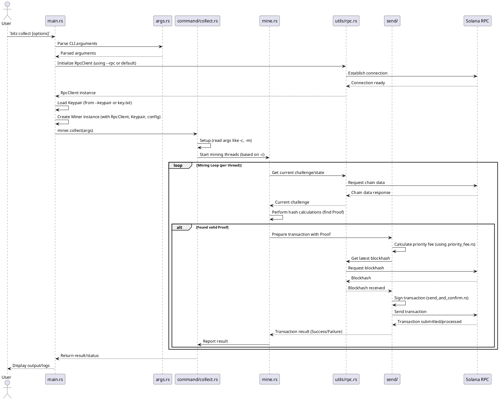

# BITZ Collector 项目中文文档

## 1. 项目概述

BITZ Collector 是一个命令行界面（CLI）工具，专用于 BITZ 加密货币的收集（通常指挖矿过程）。用户可以通过该工具利用本地计算机的 CPU 算力参与 BITZ 网络，寻找有效的哈希证明（Proof），并将其提交到链上以获取奖励。它支持连接到 Solana 网络，并提供了账户查询、代币领取、转账等辅助功能。

## 2. 项目结构

```
.
├── .cargo-ok
├── .cargo_vcs_info.json
├── .cursor/
├── .env                 # 环境变量 (可能包含敏感信息，如 RPC URL，虽然默认 RPC 在代码中)
├── .git/
├── .github/
├── .gitignore
├── Cargo.lock           # 精确的依赖版本锁定
├── Cargo.toml           # 项目元数据和依赖声明
├── Cargo.toml.orig
├── README.md            # 项目英文介绍和基本使用说明
├── key.txt              # 默认存储用户私钥的文件
├── rust-toolchain.toml  # 指定使用的 Rust 工具链版本
└── src/                 # 源代码目录
    ├── args.rs          # 定义命令行参数结构和解析逻辑
    ├── command/         # 存放各子命令具体实现逻辑的模块
    │   ├── account.rs     # 实现 'account' 命令 (查询账户信息)
    │   ├── benchmark.rs   # 实现 'benchmark' 命令 (测试本地算力)
    │   ├── claim.rs       # 实现 'claim' 命令 (领取收益)
    │   ├── collect.rs     # 实现 'collect' 命令 (启动收集/挖矿)
    │   ├── initialize.rs  # 实现 'initialize' 命令 (可能用于程序初始化，需特定 feature)
    │   ├── mine.rs        # 核心挖矿/哈希计算逻辑
    │   ├── mod.rs         # command 模块声明文件
    │   ├── pool.rs        # 实现 'pool' 命令 (连接矿池相关)
    │   ├── program.rs     # 实现 'program' 命令 (查询链上程序变量)
    │   ├── stake.rs       # 实现 'stake' 命令 (管理质押)
    │   ├── transaction.rs # 实现 'transaction' 命令 (查询交易详情)
    │   └── transfer.rs    # 实现 'transfer' 命令 (发送 BITZ)
    ├── error.rs         # 定义项目特定的错误类型
    ├── main.rs          # 程序主入口，负责解析参数、初始化和分发命令
    ├── send/            # 存放与发送 Solana 交易相关的逻辑模块
    │   ├── mod.rs         # send 模块声明文件
    │   ├── priority_fee.rs # 计算和管理交易优先费用
    │   └── send_and_confirm.rs # 封装发送交易并等待确认的逻辑
    └── utils/           # 存放通用工具函数和辅助模块
        ├── io.rs          # 输入/输出相关工具 (如读取密钥文件)
        ├── mod.rs         # utils 模块声明文件
        ├── rpc.rs         # 与 Solana RPC 节点交互的辅助函数
        └── table.rs       # 用于格式化输出 (如表格) 的工具
```

## 3. 核心文件/目录说明

*   **`Cargo.toml`**: Rust 项目的清单文件。定义了项目名称、版本、作者、依赖库（如 `clap` 用于命令行解析，`solana-sdk`, `solana-client` 用于 Solana 交互，`tokio` 用于异步处理等）以及可能的编译特性（如 `admin`）。
*   **`README.md`**: 项目的英文文档，包含安装指南、基本用法示例和一些配置说明。是快速了解项目的好起点。
*   **`key.txt`**: 默认情况下，程序会从此文件读取用户的 Solana 密钥对（私钥）。支持 Base58 编码或 JSON 数组格式。用户可以通过 `--keypair` 参数指定其他文件。**请务必妥善保管此文件，泄露私钥将导致资产损失。**
*   **`.env`**: 用于存储环境变量，例如可以设置 RPC URL 或其他敏感配置，但具体使用取决于代码实现。
*   **`src/`**: 存放所有 Rust 源代码。
    *   **`main.rs`**: 程序的入口点。
        1.  定义顶层命令行参数结构 (`Args`) 和子命令枚举 (`Commands`)。
        2.  使用 `clap` 解析用户输入的命令和参数。
        3.  初始化 Solana `RpcClient`，用于与 Solana 网络交互。
        4.  加载用户密钥对 (`Signer`)。
        5.  创建一个核心的 `Miner` 结构体实例，该实例封装了配置信息（RPC、密钥、费用等）和状态。
        6.  根据解析到的子命令，调用 `Miner` 实例上对应的方法（如 `miner.collect(args)`) 来执行具体操作。
    *   **`args.rs`**: 使用 `clap` 宏定义了所有命令行参数（全局参数如 `--rpc`, `--keypair`, `--priority-fee`）和各个子命令所需的特定参数（如 `CollectArgs`, `ClaimArgs` 等）。
    *   **`error.rs`**: 定义了项目中使用的自定义错误类型 (`MinerError`)，用于统一错误处理。
    *   **`command/`**: 包含每个子命令的具体实现逻辑。
        *   `account.rs`: 实现 `bitz account` 命令，查询与用户密钥对关联的 BITZ 账户信息（如余额、状态等），并可能使用 `utils/table.rs` 格式化输出。
        *   `benchmark.rs`: 实现 `bitz benchmark` 命令，在本地运行挖矿算法，测试并报告当前的哈希计算速率（算力）。
        *   `claim.rs`: 实现 `bitz claim` 命令，构造并发送交易到 Solana 网络，以领取用户在 BITZ 系统中积累的收益。
        *   `collect.rs`: 实现 `bitz collect` 命令的核心逻辑。它负责设置挖矿参数（如线程数、难度），启动多个挖矿线程，并协调它们的工作。它会调用 `mine.rs` 中的函数来执行实际的哈希计算。
        *   `initialize.rs`: （可能需要 `admin` feature）实现 `bitz initialize`，用于执行一些一次性的初始化设置。
        *   `mine.rs`: 包含了核心的、计算密集型的挖矿算法。它接收来自 `collect.rs` 的任务（如当前的 challenge），然后循环计算哈希，直到找到符合当前网络难度要求的 Proof (有效解)。这是最消耗 CPU 资源的部分。
        *   `pool.rs`: 实现 `bitz pool` 命令，处理与连接 BITZ 矿池相关的功能（具体细节需查看代码）。
        *   `program.rs`: 实现 `bitz program` 命令，用于查询 BITZ 在 Solana 链上部署的智能合约的一些全局状态或变量。
        *   `stake.rs`: 实现 `bitz stake` 命令，处理与 BITZ 质押相关的功能（发送质押/取消质押交易等）。
        *   `transaction.rs`: 实现 `bitz transaction` 命令，根据用户提供的交易签名查询 Solana 链上特定 BITZ 相关交易的详细信息。
        *   `transfer.rs`: 实现 `bitz transfer` 命令，构造并发送交易，将用户的 BITZ 代币转移到另一个 Solana 地址。
    *   **`send/`**: 包含发送 Solana 交易的通用逻辑。
        *   `priority_fee.rs`: 实现计算动态或静态优先费用的逻辑，以提高交易被 Solana 网络快速处理的概率。可能涉及连接到特定的动态费用估算 URL。
        *   `send_and_confirm.rs`: 提供一个封装好的函数，用于将构造好的 Solana 交易发送到 RPC 节点，并等待网络确认，同时处理可能的网络错误和超时。
    *   **`utils/`**: 包含项目中多处用到的辅助函数和模块。
        *   `io.rs`: 提供读取文件（特别是密钥文件）的函数。
        *   `rpc.rs`: 封装了一些与 Solana `RpcClient` 交互的常用操作，例如获取账户信息、获取最新区块哈希等，简化 `command/` 模块中的代码。
        *   `table.rs`: 提供创建和打印格式化表格的工具函数，用于改善命令行输出的可读性（例如 `account` 命令的输出）。

## 4. 安装与配置

### 依赖安装

首先，确保你安装了 Rust 工具链和 `cargo` 包管理器。访问 [https://www.rust-lang.org/tools/install](https://www.rust-lang.org/tools/install) 获取安装指南。

根据你的操作系统，可能需要安装额外的系统依赖：

*   **Linux (Debian/Ubuntu):**
    ```bash
    sudo apt-get update
    sudo apt-get install openssl pkg-config libssl-dev
    ```
*   **macOS:**
    ```bash
    brew install openssl pkg-config
    # 如果遇到 OpenSSL 相关问题，可能需要设置环境变量
    export PATH="/opt/homebrew/opt/openssl/bin:$PATH" # M系列芯片路径
    # export PATH="/usr/local/opt/openssl/bin:$PATH" # Intel芯片路径
    export LDFLAGS="-L/opt/homebrew/opt/openssl/lib"
    export CPPFLAGS="-I/opt/homebrew/opt/openssl/include"
    # 根据你的 brew 安装路径和芯片类型调整
    ```
*   **Windows:**
    建议使用 Chocolatey 包管理器：
    ```powershell
    choco install openssl pkgconfiglite
    ```

### 安装 BITZ Collector

你可以直接使用 `cargo` 从 crates.io (如果已发布) 安装：
```bash
cargo install bitz
```
或者，从源代码编译安装：
```bash
# 1. 克隆仓库 (假设你已获取源码)
# git clone <repository_url>
# cd bitz-collector
# 2. 编译并安装到 ~/.cargo/bin/
cargo install --path .
```
编译后的可执行文件通常位于 `target/release/bitz` (Linux/macOS) 或 `target\\release\\bitz.exe` (Windows)。你可以将其复制到你的 PATH 环境变量包含的目录中，或者直接使用完整路径运行。

### 配置

1.  **私钥 (Keypair)**:
    *   **必须**: 创建一个 Solana 钱包并获取其私钥。
    *   将私钥保存到项目根目录下的 `key.txt` 文件中。格式可以是 Base58 字符串（例如 `5hquDi4CK...NyjPwcA`）或者 JSON 数组格式（例如 `[12, 34, 56, ..., 78]`)。
    *   **或者**: 你可以使用 `--keypair <文件路径>` 参数在运行时指定不同的私钥文件。
    *   **安全提示**: 确保 `key.txt` 文件的权限设置安全，防止未授权访问。

2.  **RPC 节点**:
    *   程序需要连接到一个 Solana RPC 节点来与区块链交互。
    *   默认 RPC 地址是 `https://mainnetbeta-rpc.eclipse.xyz/` (硬编码在 `main.rs` 的参数定义中)。
    *   你可以通过 `--rpc <RPC_URL>` 全局参数指定不同的 RPC 节点。例如，使用 QuickNode, Alchemy 或你自己的节点。
    *   程序也会尝试加载 Solana CLI 的默认配置文件 (`~/.config/solana/cli/config.yml`) 中的 `json_rpc_url`，如果 `--rpc` 未指定且配置文件存在。

3.  **优先费用 (Priority Fee)**:
    *   为了提高交易被处理的速度，可以设置优先费用。
    *   使用 `--priority-fee <microlamports>` 参数设置一个固定的优先费用（单位是 microlamports，即 0.000001 SOL）。默认值是 `1000`。
    *   可以通过添加 `--dynamic-fee` 标志启用动态费用。程序会尝试从 `--dynamic-fee-url` (如果提供) 或默认 RPC 获取推荐费用，并将 `--priority-fee` 作为上限。

## 5. 使用方法

BITZ Collector 提供了一系列子命令来执行不同操作。你可以通过在主命令或任何子命令后添加 `-h` 或 `--help` 来获取帮助信息。

```bash
bitz -h # 查看所有可用命令
bitz collect -h # 查看 collect 命令的详细帮助
```

### 主要命令

*   **`bitz collect [OPTIONS]`**: 启动 BITZ 收集/挖矿进程。
    *   `-m, --min-difficulty <DIFFICULTY>`: 设置最小挖矿难度。
    *   `-c, --cpu <CPU_COUNT>`: 指定用于挖矿的 CPU 线程数（默认为系统核心数 - 1）。
*   **`bitz claim [OPTIONS]`**: 领取你已挖到的 BITZ 奖励。
*   **`bitz account [OPTIONS]`**: 查看你的 BITZ 账户信息（余额等）。
*   **`bitz benchmark [OPTIONS]`**: 测试你机器的哈希计算能力（算力）。
*   **`bitz pool [OPTIONS]`**: （需要更多信息）连接到矿池进行挖矿。
*   **`bitz program [OPTIONS]`**: 查询 BITZ 链上程序的状态信息。
*   **`bitz stake [OPTIONS]`**: 管理你的 BITZ 质押。
*   **`bitz transaction <SIGNATURE>`**: 查看指定交易签名的 BITZ 交易详情。
*   **`bitz transfer <RECIPIENT_ADDRESS> <AMOUNT> [OPTIONS]`**: 将指定数量的 BITZ 发送到另一个地址。

### 常用示例

```bash
# 使用默认配置开始挖矿 (使用 key.txt, 默认 RPC, 默认 CPU 数)
bitz collect

# 指定使用 8 个 CPU 核心进行挖矿
bitz collect -c 8

# 设置最小难度为 25 开始挖矿
bitz collect -m 25

# 使用位于 /path/to/mykey.txt 的私钥，并连接到自定义 RPC 节点
bitz collect --keypair /path/to/mykey.txt --rpc https://api.mainnet-beta.solana.com

# 检查账户余额
bitz account

# 领取代币
bitz claim

# 发送 100 BITZ 到目标地址
bitz transfer TARGET_WALLET_ADDRESS 100
```

### 自动重启

由于网络波动或其他原因，挖矿进程可能会中断。`README.md` 中提供了自动重启的脚本：

*   **macOS/Linux:**
    创建一个 `.sh` 文件（例如 `start_miner.sh`）:
    ```bash
    #!/bin/bash
    while true; do
      echo "启动 BITZ Collector..."
      bitz collect # 在这里可以添加你的常用参数，如 -c 8
      echo "程序已退出，将在 5 秒后重启..."
      sleep 5
    done
    ```
    然后赋予执行权限并运行：`chmod +x start_miner.sh && ./start_miner.sh`

*   **Windows (PowerShell):**
    ```powershell
    while($true){ try{ .\bitz.exe collect } catch{} Write-Host "程序退出，正在重启..."; Start-Sleep -Seconds 5 }
    ```
    (请确保 `bitz.exe` 在当前目录或 PATH 中，并根据需要添加参数)

## 6. 核心流程：收集 (Collect)

`bitz collect` 是最核心的命令，它启动了实际的挖矿过程。以下是该流程的可视化表示和详细步骤。

### PlantUML 图



### 流程详解

1.  **用户执行命令**: 用户在终端输入 `bitz collect`，并可能附加选项，如 `-c 8` (指定 CPU 核心数) 或 `--keypair my_other_key.txt`。
2.  **参数解析 (`main.rs` -> `args.rs`)**: 程序入口 `main` 函数接收到命令。它利用 `clap` 库和 `args.rs` 中定义的结构来解析用户提供的命令行参数和子命令。
3.  **RPC 客户端初始化 (`main.rs` -> `utils/rpc.rs` -> `Solana RPC`)**: 程序根据 `--rpc` 参数或默认值，创建一个 `RpcClient` 实例，用于后续与 Solana 区块链进行通信。
4.  **加载密钥对 (`main.rs`)**: 程序读取 `--keypair` 参数指定的文件或默认的 `key.txt` 文件，加载用户的 Solana 密钥对。这个密钥对将用于签署交易。
5.  **创建 Miner 实例 (`main.rs`)**: 一个核心的 `Miner` 数据结构被创建，它包含了所有必要的配置信息（如 RPC 连接、密钥对、优先费用设置）和程序运行时的状态（通过 `Arc<RwLock<...>>` 共享）。
6.  **调用 Collect 命令 (`main.rs` -> `command/collect.rs`)**: `main` 函数根据解析到的子命令，调用 `miner` 实例上的 `collect` 方法，并将解析后的参数传递给它。
7.  **设置并启动挖矿线程 (`command/collect.rs` -> `mine.rs`)**: `collect.rs` 中的 `collect` 函数开始执行。它会读取 `-c` 参数来确定要启动多少个 CPU 挖矿线程。随后，它为每个线程创建一个任务，并调用 `mine.rs` 中的核心挖矿函数来启动这些线程。
8.  **挖矿循环 (`mine.rs` -> `utils/rpc.rs` -> `Solana RPC`)**:
    *   每个挖矿线程独立运行一个循环。
    *   **获取挑战**: 在循环开始时，线程通常需要从 Solana 网络获取当前的“挑战”或其他挖矿所需的状态信息（例如，最新的区块哈希、当前难度等）。这通过调用 `utils/rpc.rs` 中的辅助函数完成，后者再与 `Solana RPC` 节点通信。
    *   **哈希计算**: 线程利用 CPU 执行密集的哈希计算或其他算法，尝试找到一个满足当前 BITZ 网络难度要求的“Proof”（有效解）。这是挖矿过程中最耗时的部分。
9.  **找到 Proof 并提交 (`mine.rs` -> `send/` -> `utils/rpc.rs` -> `Solana RPC`)**:
    *   一旦某个线程找到了一个有效的 Proof。
    *   **准备交易**: 它会调用 `send/` 模块中的函数来构造一个 Solana 交易。这个交易包含了找到的 Proof 以及其他必要信息。
    *   **计算费用**: `send/priority_fee.rs` 中的逻辑被用来计算交易的优先费用，以增加交易被网络快速确认的可能性。
    *   **获取区块哈希**: 发送交易前需要获取 Solana 网络最新的区块哈希，这通过 `utils/rpc.rs` 完成。
    *   **签名并发送**: `send/send_and_confirm.rs` 中的函数使用用户的密钥对签署交易，然后将其发送给 `Solana RPC` 节点。
    *   **等待确认**: 程序等待 Solana 网络确认该交易。
10. **处理结果 (`send/` -> `mine.rs` -> `command/collect.rs` -> `main.rs` -> `User`)**:
    *   交易发送的结果（成功或失败）被返回给挖矿线程。
    *   线程将结果报告给 `collect.rs` 中的主协调逻辑。
    *   最终，执行结果或相关的日志信息会通过 `main.rs` 输出到用户的终端。
11. **循环/退出**: 挖矿线程通常会继续循环，获取新的挑战并寻找下一个 Proof，直到用户手动停止程序（例如按 Ctrl+C）或发生不可恢复的错误。